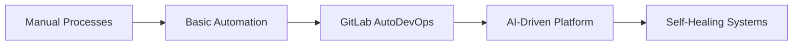

# Strategic GitLab Analytics Insights

## Context
Diese Datei dokumentiert strategische Überlegungen für GitLab Analytics, die als Grundlage für erweiterte Dashboards und langfristige Transformation dienen.

## Aktuelle Implementierung - Enhanced KPI Dashboard

### 🎯 Implementierte Features (2025-07-28)
1. **P1-P6 Enhanced KPI Analysis**: Issue, MR, CI/CD, Config, Submodules, Performance
2. **Actionable Dashboard**: Critical Issues + Best Practices mit konkreten Umsetzungsschritten
3. **Performance Optimization**: 90% schnellere Binary-Detection, intelligente Cache-Nutzung
4. **Modular Architecture**: Dashboard-Module für verschiedene Analyse-Bereiche
5. **Incremental Analysis**: Automatische Enhanced KPI Generierung bei fehlenden Daten

### 🎯 Top 5 Strategic Opportunities
1. **CI/CD Adoption Gap**: Repositories ohne Pipelines → Automatische Template-Generierung
2. **Storage & Performance Crisis**: Ineffiziente Storage-Nutzung → LFS Migration + Cleanup
3. **Knowledge Silos**: Single-Contributor Repositories → Collaboration Förderung
4. **Security Blind Spots**: Fehlende SAST/DAST Coverage → GitLab Security Features
5. **Developer Experience**: Niedrige Health Scores → Workflow Optimierung

### 📈 DevOps Maturity Assessment
```
Level 0 (No CI/CD): 240 repos (69.6%) ⚠️
Level 1 (Basic CI):  80 repos (23.2%)
Level 2 (Advanced):  25 repos (7.2%)
Level 3+:            0 repos (0%)
```

### 💰 ROI Potential
- **Immediate Wins**: 960h/Monat durch CI/CD Templates
- **Storage Savings**: €860/Jahr durch Optimierung
- **Productivity Gains**: 300-400% Steigerung innerhalb 12 Monaten

## Strategic Transformation Roadmap

### Phase 1: Foundation (0-6 Monate)
- **"CI/CD Everywhere" Campaign**: 100% Coverage Ziel
- **"Kill the Silos" Program**: Cross-team Collaboration
- **Security Quick Wins**: GitLab Ultimate Features

### Phase 2: Excellence (6-12 Monate)
- **GitOps Transformation**: Infrastructure as Code
- **Performance Excellence**: <5min Build Times
- **AI-Powered Development**: Automated Code Review

### Phase 3: Innovation (12+ Monate)
- **Platform Engineering**: Internal Developer Platform
- **Predictive Analytics**: Issue & Performance Forecasting
- **Self-Healing Systems**: Automated Remediation

## Advanced Dashboard Concepts

### 🎯 Strategic Dashboard Tabs (Future Enhancement)
1. **Strategic Roadmap** - 3-Horizon Transformation Plan
2. **Maturity Assessment** - 5-Level DevOps Reifegrad mit Benchmark
3. **Golden Patterns** - Best Practice Repository Showcase
4. **Risk Heatmap** - Security, Knowledge Silos, Technical Debt
5. **ROI Calculator** - Investment vs. Productivity Gains
6. **Auto-Remediation** - Intelligent Automation Dashboard

### 🤖 Advanced Automation Ideas
```python
# Auto-Remediation Bot Konzept
auto_remediation_strategies = {
    "missing_ci": "generate_ci_template_from_language_detection()",
    "large_files": "migrate_to_lfs_with_history_preservation()",
    "security_gaps": "enable_sast_dast_with_smart_defaults()",
    "knowledge_silos": "suggest_pair_programming_matches()",
    "performance_issues": "optimize_pipeline_parallelization()"
}
```

### 📊 Enhanced KPI Framework
```python
strategic_metrics = {
    # DevOps Maturity
    "maturity_distribution": "track_level_progression_over_time()",
    "collaboration_index": "avg_contributors_per_repo_trend()",

    # Business Impact
    "developer_velocity": "story_points_per_sprint_improvement()",
    "deployment_frequency": "releases_per_week_increase()",
    "lead_time": "idea_to_production_reduction()",

    # Platform Health
    "system_reliability": "uptime_and_error_rate_tracking()",
    "security_posture": "vulnerability_detection_and_resolution()",
    "cost_efficiency": "infrastructure_cost_per_developer()"
}
```

## Golden Repository Patterns

### 🏆 Best Practice Examples (aus aktueller Analyse)
1. **GeneralIoService** (ID: 387)
   - Health Score: 100, Pipeline Success: 85%
   - Multi-contributor, Proper branching (develop/master)
   - **Pattern**: C++ mit CI/CD Excellence

2. **frontend** (ID: 391)
   - Health Score: 100, Hotness Score: 20
   - Modern structure, Recent activity
   - **Pattern**: Modern Web Development

### 🚨 Anti-Patterns to Eliminate
- **Qt1Mal1**: 149MB ohne Struktur, 0 Contributors
- **io_tests**: 720MB ohne LFS, Performance-kritisch
- **Orphaned Repos**: 4 Repositories ohne Owner

## Implementation Priority Matrix

| Initiative | Impact | Effort | Risk | ROI | Timeline |
|------------|--------|--------|------|-----|----------|
| CI/CD Templates | High | Low | Low | 960h/month | 30 days |
| Git LFS Migration | High | Medium | Low | €210/year | 60 days |
| Security Scanning | High | Low | Low | Compliance | 30 days |
| Repository Consolidation | Medium | High | Medium | Maintenance | 6 months |
| DevOps Platform | High | High | Medium | 300% productivity | 12 months |

## Technology Stack Evolution

### Current State → Future Vision


### Modern GitLab Feature Adoption Roadmap
- **Phase 1**: Auto DevOps, Security Scanning, Pages
- **Phase 2**: Container Registry, Package Registry, Monitoring
- **Phase 3**: GitOps, Progressive Delivery, ML Ops

## Cost-Benefit Analysis

### Investment Areas
1. **GitLab Ultimate**: €X/user/month für Security & Compliance
2. **Training & Enablement**: €X für DevOps Upskilling
3. **Infrastructure**: €X für Runner & Storage Optimization
4. **Tooling**: €X für Monitoring & Automation

### Expected Returns
- **Time Savings**: 960h/month = €X/year in developer productivity
- **Quality Improvements**: Reduced bug fixing time = €X/year
- **Compliance**: Avoided penalties & audit costs = €X/year
- **Innovation Speed**: Faster time-to-market = €X/year competitive advantage

## Future Research & Development

### 🔬 Advanced Analytics Opportunities
1. **Predictive Issue Detection**: ML models für Codebase Health
2. **Intelligent Resource Allocation**: Dynamic Runner Scaling
3. **Automated Code Review**: AI-powered Quality Gates
4. **Developer Experience Optimization**: Personalized Workflows

### 🌐 Industry Benchmarking
- **DORA Metrics**: Deployment Frequency, Lead Time, MTTR, Change Failure Rate
- **DevOps Research**: State of DevOps Report Vergleich
- **Enterprise Patterns**: Fortune 500 GitLab Success Stories

## Conclusion

Die strategische Analyse zeigt enormes Transformationspotential. Das aktuelle **Actionable Dashboard** bietet den perfekten Einstieg für Quick Wins, während diese strategischen Überlegungen die langfristige Roadmap definieren.

**Next Steps**:
1. Implementierung der taktischen Empfehlungen aus dem Actionable Dashboard
2. Schrittweise Integration strategischer Elemente basierend auf Business-Prioritäten
3. Kontinuierliches Monitoring und Anpassung der Transformation

---
*Erstellt: 2025-07-27*
*Autoren: Claude Sonnet (Implementierung) + Claude Opus (Strategie)*
*Status: Strategic Vision - Implementation on Demand*
